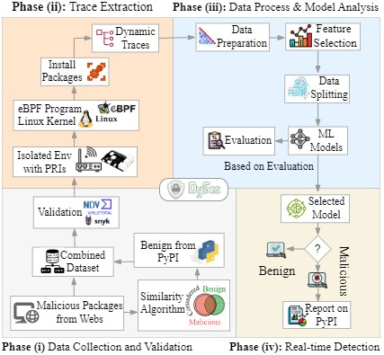

# DySec
A Machine Learning-Based Dynamic Analysis For Detecting Malicious Packages In PyPI Ecosystem

## Overview

Malicious python packages make software supply chains vulnerable by exploiting trust in open-source repositories like **PyPI**.  
Lack of real-time behavioral monitoring renders metadata inspection and static code analysis inadequate against advanced attack strategies such as **typosquatting**, **covert remote access activation**, and **dynamic payload generation**.  

To address these challenges, we introduce **DySec**, a machine-learning-based **dynamic analysis framework** for PyPI that uses **eBPF kernel and user-level probes** to monitor package behavior during installation.  

DySec captures **36 real-time behavioral features**, including:
- System calls  
- Network traffic  
- Resource usage  
- Directory access  
- Installation patterns  

By analyzing these behaviors, DySec detects **typosquatting**, **covert remote access activation**, **dynamic payload generation**, and **multiphase attack malware**.

We developed a comprehensive dataset of **14,271 Python packages** including **7,127 malicious samples** executed in an isolated environment.

Experimental results demonstrate that **DySec achieves 96% detection accuracy** with **<0.5 s inference latency** after feature extraction, reducing false negatives by **78.65%** compared to static analysis and **82.24%** compared to metadata analysis.  

During evaluation, DySec flagged eleven packages that PyPI classified as benign — **manual analysis confirmed six as malicious**, leading to **four removals by PyPI maintainers**. 

DySec thus bridges the gap between **reactive traditional methods** and **proactive, scalable threat mitigation** in open-source ecosystems.

<p align="center">
  
</p>
<p align="center"><em>Figure 1: The overall workflow of DySec for detecting malicious packages.</em></p>

---

## Citation

If you use this study in your research, please cite it as:

```bibtex
@article{Mehedi2025DySec,
  author         = {Sk Tanzir Mehedi and Chadni Islam and Gowri Ramachandran and Raja Jurdak},
  title          = {DySec: A Machine Learning-based Dynamic Analysis for Detecting Malicious Packages in the PyPI Ecosystem},
  journal        = {arXiv preprint},
  year           = {2025},
  eprint         = {2503.00324},
  archive-prefix = {arXiv},
  primary-class  = {cs.CR},
  doi            = {10.48550/arXiv.2503.00324},
  url            = {https://arxiv.org/abs/2503.00324}
}
```

## Authors

- **Sk Tanzir Mehedi** (Queensland University of Technology)  
  [ORCID](https://orcid.org/0000-0003-4435-7856)
- **Chadni Islam** (Edith Cowan University)  
  [ORCID](https://orcid.org/0000-0002-6349-6483)
- **Gowri Ramachandran** (Queensland University of Technology)  
  [ORCID](https://orcid.org/0000-0001-5944-1335)
- **Raja Jurdak** (Queensland University of Technology)  
  [ORCID](https://orcid.org/0000-0001-7517-0782)

## Directory

```
Repository
│
├── data/
│   │
│   ├── select-data.py
│   └── split-data.py
│
├── dataset/
│   │
│   ├── QUT-DV25-Processed/
│   │   │
│   │   ├── QUT-DV25-Filetop-Traces/
│   │   ├── QUT-DV25-Install-Traces/
│   │   ├── QUT-DV25-Opensnoop-Traces/
│   │   ├── QUT-DV25-Pattern-Traces/
│   │   ├── QUT-DV25-SysCall-Traces/
│   │   └── QUT-DV25-TCP-Traces/
│   │
│   ├── QUT-DV25-Raw/
│   │   │
│   │   ├── QUT-DV25-Benign/
│   │   │   │
│   │   │   ├── QUT-DV25-Filetop-Traces/
│   │   │   ├── QUT-DV25-Installation-Traces/
│   │   │   ├── QUT-DV25-Opensnoop-Traces/
│   │   │   ├── QUT-DV25-PIDs/
│   │   │   ├── QUT-DV25-Pattern-Traces/
│   │   │   └── QUT-DV25-TCP-Traces/
│   │   │
│   │   └── QUT-DV25-Malicious/
│   │       │
│   │       ├── QUT-DV25-Filetop-Traces/
│   │       ├── QUT-DV25-Installation-Traces/
│   │       ├── QUT-DV25-Opensnoop-Traces/
│   │       ├── QUT-DV25-PIDs/
│   │       ├── QUT-DV25-Pattern-Traces/
│   │       └── QUT-DV25-TCP-Traces/
│   │
│   ├── QUT-DV25.csv
│   ├── README.md
│   ├── test.csv
│   ├── train.csv
│   └── val.csv
│
├── models/
│   │
│   ├── Decision-Tree.pkl
│   ├── Gradient-Boosting.pkl
│   ├── KNN.pkl
│   ├── Logistic-Regression.pkl
│   ├── Random-Forest.pkl
│   └── SVM.pkl
│
├── reports/
│   │
│   ├── confusion.png
│   ├── evaluation.csv
│   ├── evaluation.png
│   └── roc.png
│
├── src/
│   │
│   ├── scripts/
│   │   │
│   │   ├── monitor.sh
│   │   ├── prerequisites.sh
│   │   └── trace.sh
│   │
│   ├── evaluate.py
│   ├── extract.py
│   ├── main.py
│   ├── predict.py
│   ├── preprocess.py
│   └── train.py
│
├── .gitignore
└── README.md
```

## Usage

### 1. Prerequisites & Environment Setup

Install kernel monitoring dependencies, eBPF toolkits (`bcc-tools`), `strace`, and Python dependencies:

```bash
sudo bash src/scripts/prerequisites.sh
chmod +x src/scripts/trace.sh src/scripts/monitor.sh
```

---

### 2. End-to-End Pipeline (One-Click Analysis)

Run live dynamic tracing, feature extraction, and multi-model consensus prediction in a single command:

```bash
sudo python3 src/main.py <package_name> [duration]
```

*Example (trace and analyze `requests` for 30 seconds):*
```bash
sudo python3 src/main.py requests 30
```

*If traces already exist and you want to extract and predict without re-installing:*
```bash
python3 src/main.py requests --skip
```

---

### 3. Step-by-Step Execution

#### Step 1: Capture Dynamic Telemetry
Attach eBPF probes (`opensnoop`, `tcpstates`, `filetop`) and `strace` during isolated package installation:

```bash
sudo bash src/scripts/trace.sh <package_name> [duration]
```

#### Step 2: Extract 36 Selected Engineered Features (SEF)
Parse kernel and user-space telemetry into a 36-feature CSV:

*From live traces:*
```bash
python3 src/extract.py --pkg <package_name> --out <package_name>.csv
```

*From QUT-DV25 raw dataset:*
```bash
python3 src/extract.py --root dataset/QUT-DV25-Raw/QUT-DV25-Malicious --layout qut --pkg <package_name> --out <package_name>.csv
```

#### Step 3: Run Multi-Model AI Consensus Prediction
Predict the package's maliciousness across all 6 trained classifiers:

```bash
python3 src/predict.py <package_name>.csv
```

---

### 4. Model Training & Evaluation

#### Train All 6 Classifiers:
Train `Random Forest`, `Decision Tree`, `Gradient Boosting`, `SVM`, `Logistic Regression`, and `KNN` on `dataset/train.csv`:

```bash
python3 src/train.py
```

#### Benchmark on Independent Test Set:
Evaluate model performance on `dataset/test.csv` (N = 2,141) and automatically generate publication-grade evaluation artifacts (`reports/evaluation.png`, `reports/evaluation.csv`, `reports/confusion.png`, `reports/roc.png`):

```bash
python3 src/evaluate.py
```
