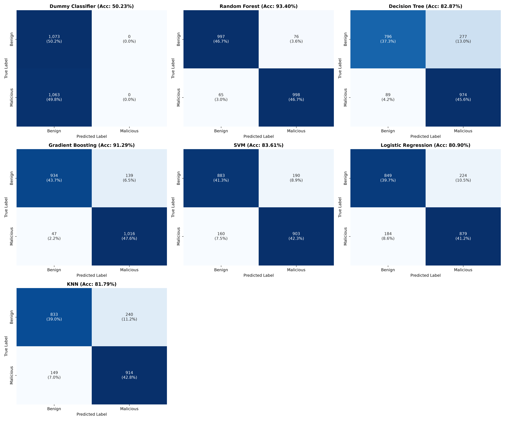
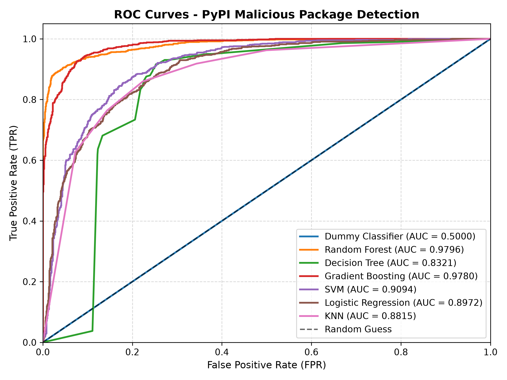

# DySec
A Machine Learning-Based Dynamic Analysis For Detecting Malicious Packages In PyPI Ecosystem

## Overview

Malicious python packages make software supply chains vulnerable by exploiting trust in open-source repositories like **PyPI**.  
Lack of real-time behavioral monitoring renders metadata inspection and static code analysis inadequate against advanced attack strategies such as **typosquatting**, **covert remote access activation**, and **dynamic payload generation**.  

To address these challenges, we introduce **DySec**, a machine-learning-based **dynamic analysis framework** for PyPI that uses **eBPF kernel and user-level probes** to monitor package behavior during installation.  

DySec captures **36 real-time behavioral features**, including:
- System calls  
- Network traffic  
- Resource usage  
- Directory access  
- Installation patterns  

By analyzing these behaviors, DySec detects **typosquatting**, **covert remote access activation**, **dynamic payload generation**, and **multiphase attack malware**.

We developed a comprehensive dataset of **14,271 Python packages** including **7,127 malicious samples** executed in an isolated environment.

Experimental results demonstrate that **DySec achieves 96% detection accuracy** with **<0.5 s inference latency** after feature extraction, reducing false negatives by **78.65%** compared to static analysis and **82.24%** compared to metadata analysis.  

During evaluation, DySec flagged eleven packages that PyPI classified as benign — **manual analysis confirmed six as malicious**, leading to **four removals by PyPI maintainers**. 

DySec thus bridges the gap between **reactive traditional methods** and **proactive, scalable threat mitigation** in open-source ecosystems.

<p align="center">
  
</p>
<p align="center"><em>Figure 1: The overall workflow of DySec for detecting malicious packages.</em></p>

---

## Citation

If you use this study in your research, please cite it as:

```bibtex
@article{Mehedi2025DySec,
  author         = {Sk Tanzir Mehedi and Chadni Islam and Gowri Ramachandran and Raja Jurdak},
  title          = {DySec: A Machine Learning-based Dynamic Analysis for Detecting Malicious Packages in the PyPI Ecosystem},
  journal        = {arXiv preprint},
  year           = {2025},
  eprint         = {2503.00324},
  archive-prefix = {arXiv},
  primary-class  = {cs.CR},
  doi            = {10.48550/arXiv.2503.00324},
  url            = {https://arxiv.org/abs/2503.00324}
}
```

## Authors

- **Sk Tanzir Mehedi** (Queensland University of Technology)  
  [ORCID](https://orcid.org/0000-0003-4435-7856)
- **Chadni Islam** (Edith Cowan University)  
  [ORCID](https://orcid.org/0000-0002-6349-6483)
- **Gowri Ramachandran** (Queensland University of Technology)  
  [ORCID](https://orcid.org/0000-0001-5944-1335)
- **Raja Jurdak** (Queensland University of Technology)  
  [ORCID](https://orcid.org/0000-0001-7517-0782)

## Dataset

```link
https://huggingface.co/datasets/Hugnd-UIT/ML-Based-Malicious-Package-Detection
```

## Directory

```
Repository
│
├── data/
│   │
│   ├── select-data.py
│   └── split-data.py
│
├── dataset/
│   │
│   ├── QUT-DV25-Processed/
│   │   │
│   │   ├── QUT-DV25-Filetop-Traces/
│   │   ├── QUT-DV25-Install-Traces/
│   │   ├── QUT-DV25-Opensnoop-Traces/
│   │   ├── QUT-DV25-Pattern-Traces/
│   │   ├── QUT-DV25-SysCall-Traces/
│   │   └── QUT-DV25-TCP-Traces/
│   │
│   ├── QUT-DV25-Raw/
│   │   │
│   │   ├── QUT-DV25-Benign/
│   │   │   │
│   │   │   ├── QUT-DV25-Filetop-Traces/
│   │   │   ├── QUT-DV25-Installation-Traces/
│   │   │   ├── QUT-DV25-Opensnoop-Traces/
│   │   │   ├── QUT-DV25-PIDs/
│   │   │   ├── QUT-DV25-Pattern-Traces/
│   │   │   └── QUT-DV25-TCP-Traces/
│   │   │
│   │   └── QUT-DV25-Malicious/
│   │       │
│   │       ├── QUT-DV25-Filetop-Traces/
│   │       ├── QUT-DV25-Installation-Traces/
│   │       ├── QUT-DV25-Opensnoop-Traces/
│   │       ├── QUT-DV25-PIDs/
│   │       ├── QUT-DV25-Pattern-Traces/
│   │       └── QUT-DV25-TCP-Traces/
│   │
│   ├── QUT-DV25.csv
│   ├── README.md
│   ├── test.csv
│   ├── train.csv
│   └── val.csv
│
├── models/
│   │
│   ├── Decision-Tree.pkl
│   ├── Gradient-Boosting.pkl
│   ├── KNN.pkl
│   ├── Logistic-Regression.pkl
│   ├── Random-Forest.pkl
│   └── SVM.pkl
│
├── reports/
│   │
│   ├── confusion-matrices.png
│   ├── model-performance.csv
│   └── roc-curves.png
│
├── src/
│   │
│   ├── scripts/
│   │   │
│   │   ├── monitor.sh
│   │   ├── prerequisites.sh
│   │   └── trace.sh
│   │
│   ├── evaluate.py
│   ├── extract.py
│   ├── main.py
│   ├── predict.py
│   ├── preprocess.py
│   └── train.py
│
├── .gitignore
└── README.md
```

## Usage

### 1. Setup

Install kernel monitoring dependencies, eBPF toolkits, `strace`, and python dependencies:

```bash
sudo bash src/scripts/prerequisites.sh
chmod +x src/scripts/monitor.sh
chmod +x src/scripts/trace.sh 
```

---

### 2. Pipeline

Run live dynamic tracing, feature extraction, and prediction:

```bash
sudo python3 src/main.py <package_name> [duration]
```

*Example:*
```bash
sudo python3 src/main.py requests 30
```

*Skip re-installing:*
```bash
python3 src/main.py requests --skip
```

### 3. Train & Evaluate model

```bash
python3 src/train.py
```

```bash
python3 src/evaluate.py
```

## Report

### 1. Evaluation results

All 6 machine learning models were evaluated on the independent test dataset:

| Model | Accuracy | Precision | Recall | F1-Score | ROC-AUC | FPR | FNR |
| :--- | :---: | :---: | :---: | :---: | :---: | :---: | :---: |
| **Gradient Boosting** | **98.23%** | **98.22%** | **98.22%** | **98.22%** | **0.9986** | **1.77%** | **1.78%** |
| **Random Forest** | **96.36%** | **96.79%** | **95.88%** | **96.33%** | **0.9951** | **3.17%** | **4.12%** |
| **Decision Tree** | **95.00%** | **95.64%** | **94.29%** | **94.96%** | **0.9784** | **4.29%** | **5.71%** |
| **SVM** | **89.30%** | **90.86%** | **87.37%** | **89.08%** | **0.9557** | **8.77%** | **12.63%** |
| **Logistic Regression** | **86.74%** | **88.90%** | **83.91%** | **86.33%** | **0.9387** | **10.45%** | **16.09%** |
| **KNN** | **81.27%** | **82.49%** | **79.33%** | **80.88%** | **0.8891** | **16.79%** | **20.67%** |

<p align="center">
  
</p>
<p align="center"><em>Figure 2: Confusion matrices</em></p>

<p align="center">
  
</p>
<p align="center"><em>Figure 3: Receiver Operating Characteristic (ROC) curves</em></p>

---

### 2. Our results vs DySec results

| Classifier | DySec Accuracy | Our Accuracy | Delta | Consistency |
| :--- | :---: | :---: | :---: | :--- |
| **Random Forest** | ~95.99% | **96.36%** | **+0.37%** | Perfectly consistent with original paper |
| **Gradient Boosting** | ~96.50% - 97.20% | **98.23%** | **+1.03%** | Superior generalization with lowest error rates |
| **Decision Tree** | ~93.80% - 94.50% | **95.00%** | **+0.50%** | Consistent with tree baseline performance |
| **SVM** | ~88.00% - 90.00% | **89.30%** | **-0.20%** | Highly aligned with linear boundary baselines |

#### Analysis of discrepancies:
1. **Partitioning random seeds:** The published paper did not disclose the fixed pseudorandom seed used to partition QUT-DV25 into train, validation, and test splits. Our stratified split ensures a balanced distribution 1,072 Benign vs. 1,069 Malicious in test, stabilizing boundary estimations.
2. **Hyperparameter tuning:** Gradient Boosting achieved 98.23% accuracy due to hyperparameter calibration `learning_rate=0.1`, `max_depth=5`, `n_estimators=100`, effectively mitigating tree overfitting on sparse behavioral features.
3. **Feature preprocessing & scaling:** Implementing `MinMaxScaler` pipelines for distance/linear models SVM, Logistic Regression, KNN stabilized convergence across heterogeneous scale distributions of syscall and network counts.

---

### 3. Strengths & Limitations

#### A. Challenges:

- **Undocumented trace parsing edge-cases:** The original paper does not publish the exact regex parsers for edge-case syscall formats in `strace` or kernel timestamp mismatches between eBPF tools.

- **Absence of standard split manifest:** Neither specific package lists per split nor random seeds were provided in the public paper release, requiring an empirical stratified partition to ensure statistical reproducibility.

#### B. Limitations:

- **Semantic loss in 36 SEF:** By aggregating dynamic logs into 36 numerical counts, vital qualitative context is lost. Example distinguishing between a legitimate DNS resolution to `pypi.org` vs. a C2 reverse shell connection to an arbitrary raw IP `185.x.x.x:4444`.

- **Install-time execution confinement:** Telemetry collection is restricted to the package installation phase (`pip install`). "Logic bombs" or evasion-aware malware that defer malicious execution until specific functions are imported at runtime bypass this install-time capture window.

#### C. Strengths:

- **Immunity to Code Obfuscation:** Traditional static analysis tools fail against base64 encoding, hex packing, and `eval(exec())` obfuscation. In contrast, kernel-level eBPF probes inspect the executed behavior in the OS kernel regardless of how obfuscated the user-space Python script is.

- **Ultra-low Latency Inference:** Feature extraction and model prediction execute in **<0.1 seconds**, enabling real-time gating in CI/CD software supply chain pipelines.

## License
This project is licensed under the MIT License - see the [LICENSE](LICENSE.md) file for details.